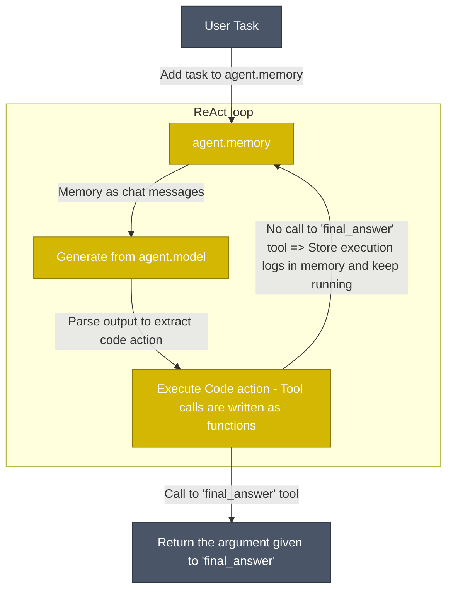

<!---
IntelCore: An intelligent agent framework for OSINT research and commercial intelligence.
-->
<p align="center">
    <!-- Uncomment when CircleCI is set up
    <a href="https://circleci.com/gh/huggingface/accelerate"></a>
    -->
    <a href="https://github.com/yourusername/intelcore/blob/main/LICENSE"></a>
    <a href="https://github.com/yourusername/intelcore/releases"></a>
</p>

<h3 align="center">
  <div style="display:flex;flex-direction:row;">
    <p>IntelCore: Intelligent Agents for OSINT Research</p>
  </div>
</h3>

`intelcore` is a library that enables you to run powerful agents for OSINT research and commercial intelligence in a few lines of code. It offers:

✨ **Simplicity**: the logic for agents fits in ~1,000 lines of code (see [agents.py](https://github.com/yourusername/intelcore/blob/main/src/intelcore/agents.py)). We kept abstractions to their minimal shape above raw code!

🧑‍💻 **First-class support for Code Agents**. Our [`CodeAgent`](https://github.com/yourusername/intelcore/blob/main/src/intelcore/agents.py) writes its actions in code (as opposed to "agents being used to write code"). To make it secure, we support executing in sandboxed environments via [Blaxel](https://blaxel.ai), [E2B](https://e2b.dev/), [Modal](https://modal.com/), Docker, or Pyodide+Deno WebAssembly sandbox.

🔍 **OSINT Research Focus**: Specialized tools and workflows for evidence-first OSINT research, company intelligence, and relationship mapping.

🌐 **Model-agnostic**: IntelCore supports any LLM. It can be a local `transformers` or `ollama` model, one of [many providers on the Hub](https://huggingface.co/blog/inference-providers), or any model from OpenAI, Anthropic and many others via our [LiteLLM](https://www.litellm.ai/) integration.

👁️ **Modality-agnostic**: Agents support text, vision, video, even audio inputs!

🛠️ **Tool-agnostic**: you can use tools from any [MCP server](https://github.com/yourusername/intelcore), from [LangChain](https://github.com/yourusername/intelcore), or create custom tools for your specific needs.

📊 **Evidence-First Approach**: All research outputs include source URLs, snippets, and structured fact storage for reproducibility.

## Quick demo

First install the package with a default set of tools:
```bash
pip install "intelcore[toolkit]"
```
Then define your agent, give it the tools it needs and run it!
```py
from intelcore import CodeAgent, WebSearchTool, InferenceClientModel

model = InferenceClientModel()
agent = CodeAgent(tools=[WebSearchTool()], model=model, stream_outputs=True)

agent.run("How many seconds would it take for a leopard at full speed to run through Pont des Arts?")
```

https://github.com/user-attachments/assets/84b149b4-246c-40c9-a48d-ba013b08e600

You can even share your agent to the Hub, as a Space repository:
```py
agent.push_to_hub("m-ric/my_agent")

# agent.from_hub("m-ric/my_agent") to load an agent from Hub
```

Our library is LLM-agnostic: you could switch the example above to any inference provider.

<details>
<summary> <b>InferenceClientModel, gateway for all <a href="https://huggingface.co/docs/inference-providers/index">inference providers</a> supported on HF</b></summary>

```py
from intelcore import InferenceClientModel

model = InferenceClientModel(
    model_id="deepseek-ai/DeepSeek-R1",
    provider="together",
)
```
</details>
<details>
<summary> <b>LiteLLM to access 100+ LLMs</b></summary>

```py
from intelcore import LiteLLMModel

model = LiteLLMModel(
    model_id="anthropic/claude-4-sonnet-latest",
    temperature=0.2,
    api_key=os.environ["ANTHROPIC_API_KEY"]
)
```
</details>
<details>
<summary> <b>OpenAI-compatible servers: Together AI</b></summary>

```py
import os
from intelcore import OpenAIModel

model = OpenAIModel(
    model_id="deepseek-ai/DeepSeek-R1",
    api_base="https://api.together.xyz/v1/", # Leave this blank to query OpenAI servers.
    api_key=os.environ["TOGETHER_API_KEY"], # Switch to the API key for the server you're targeting.
)
```
</details>
<details>
<summary> <b>OpenAI-compatible servers: OpenRouter</b></summary>

```py
import os
from intelcore import OpenAIModel

model = OpenAIModel(
    model_id="openai/gpt-4o",
    api_base="https://openrouter.ai/api/v1", # Leave this blank to query OpenAI servers.
    api_key=os.environ["OPENROUTER_API_KEY"], # Switch to the API key for the server you're targeting.
)
```

</details>
<details>
<summary> <b>Local `transformers` model</b></summary>

```py
from intelcore import TransformersModel

model = TransformersModel(
    model_id="Qwen/Qwen3-Next-80B-A3B-Thinking",
    max_new_tokens=4096,
    device_map="auto"
)
```
</details>
<details>
<summary> <b>Azure models</b></summary>

```py
import os
from intelcore import AzureOpenAIModel

model = AzureOpenAIModel(
    model_id = os.environ.get("AZURE_OPENAI_MODEL"),
    azure_endpoint=os.environ.get("AZURE_OPENAI_ENDPOINT"),
    api_key=os.environ.get("AZURE_OPENAI_API_KEY"),
    api_version=os.environ.get("OPENAI_API_VERSION")    
)
```
</details>
<details>
<summary> <b>Amazon Bedrock models</b></summary>

```py
import os
from intelcore import AmazonBedrockModel

model = AmazonBedrockModel(
    model_id = os.environ.get("AMAZON_BEDROCK_MODEL_ID") 
)
```
</details>

## CLI

You can run agents from CLI using two commands: `smolagent` and `webagent`.

`smolagent` is a generalist command to run a multi-step `CodeAgent` that can be equipped with various tools.

```bash
# Run with direct prompt and options
smolagent "Plan a trip to Tokyo, Kyoto and Osaka between Mar 28 and Apr 7."  --model-type "InferenceClientModel" --model-id "Qwen/Qwen3-Next-80B-A3B-Thinking" --imports pandas numpy --tools web_search

# Run in interactive mode (launches setup wizard when no prompt provided)
smolagent
```

Interactive mode guides you through:
- Agent type selection (CodeAgent vs ToolCallingAgent)  
- Tool selection from available toolbox
- Model configuration (type, ID, API settings)
- Advanced options like additional imports
- Task prompt input

Meanwhile `webagent` is a specific web-browsing agent using [helium](https://github.com/mherrmann/helium) (read more [here](https://github.com/yourusername/intelcore/blob/main/src/intelcore/vision_web_browser.py)).

For instance:
```bash
webagent "go to xyz.com/men, get to sale section, click the first clothing item you see. Get the product details, and the price, return them. note that I'm shopping from France" --model-type "LiteLLMModel" --model-id "gpt-5"
```

## How do Code agents work?

Our [`CodeAgent`](https://github.com/yourusername/intelcore/blob/main/src/intelcore/agents.py) works mostly like classical ReAct agents - the exception being that the LLM engine writes its actions as Python code snippets.



Actions are now Python code snippets. Hence, tool calls will be performed as Python function calls. For instance, here is how the agent can perform web search over several websites in one single action:
```py
requests_to_search = ["gulf of mexico america", "greenland denmark", "tariffs"]
for request in requests_to_search:
    print(f"Here are the search results for {request}:", web_search(request))
```

Writing actions as code snippets is demonstrated to work better than the current industry practice of letting the LLM output a dictionary of the tools it wants to call: [uses 30% fewer steps](https://huggingface.co/papers/2402.01030) (thus 30% fewer LLM calls) and [reaches higher performance on difficult benchmarks](https://huggingface.co/papers/2411.01747). Head to [our high-level intro to agents](https://huggingface.co/docs/smolagents/conceptual_guides/intro_agents) to learn more on that.

Especially, since code execution can be a security concern (arbitrary code execution!), we provide options at runtime:
  - a secure python interpreter to run code more safely in your environment (more secure than raw code execution but still risky)
  - a sandboxed environment using [Blaxel](https://blaxel.ai), [E2B](https://e2b.dev/), or Docker (removes the risk to your own system).

Alongside [`CodeAgent`](https://huggingface.co/docs/smolagents/reference/agents#smolagents.CodeAgent), we also provide the standard [`ToolCallingAgent`](https://huggingface.co/docs/smolagents/reference/agents#smolagents.ToolCallingAgent) which writes actions as JSON/text blobs. You can pick whichever style best suits your use case.

## How smol is this library?

We strived to keep abstractions to a strict minimum: the main code in `agents.py` has <1,000 lines of code.
Still, we implement several types of agents: `CodeAgent` writes its actions as Python code snippets, and the more classic `ToolCallingAgent` leverages built-in tool calling methods. We also have multi-agent hierarchies, import from tool collections, remote code execution, vision models...

By the way, why use a framework at all? Well, because a big part of this stuff is non-trivial. For instance, the code agent has to keep a consistent format for code throughout its system prompt, its parser, the execution. So our framework handles this complexity for you. But of course we still encourage you to hack into the source code and use only the bits that you need, to the exclusion of everything else!

## How strong are open models for agentic workflows?

We've created [`CodeAgent`](https://github.com/yourusername/intelcore/blob/main/src/intelcore/agents.py) instances with some leading models, and compared them on various benchmarks.

[Find the benchmarking code here](https://github.com/yourusername/intelcore/blob/main/examples/intelcore_benchmark/run.py) for more detail on the agentic setup used.

<p align="center">
    
</p>

This comparison shows that open-source models can now take on the best closed models!

## Security

Security is a critical consideration when working with code-executing agents. Our library provides:
- Sandboxed execution options using [Blaxel](https://blaxel.ai), [E2B](https://e2b.dev/), [Modal](https://modal.com/), Docker, or Pyodide+Deno WebAssembly sandbox
- Best practices for running agent code securely

For security policies, vulnerability reporting, and more information on secure agent execution, please see our [Security Policy](SECURITY.md).

## Contribute

Everyone is welcome to contribute, get started with our [contribution guide](https://github.com/huggingface/smolagents/blob/main/CONTRIBUTING.md).

## Cite smolagents

If you use `smolagents` in your publication, please cite it by using the following BibTeX entry.

```bibtex
@Misc{smolagents,
  title =        {`smolagents`: a smol library to build great agentic systems.},
  author =       {Aymeric Roucher and Albert Villanova del Moral and Thomas Wolf and Leandro von Werra and Erik Kaunismäki},
  howpublished = {\url{https://github.com/huggingface/smolagents}},
  year =         {2025}
}
```
